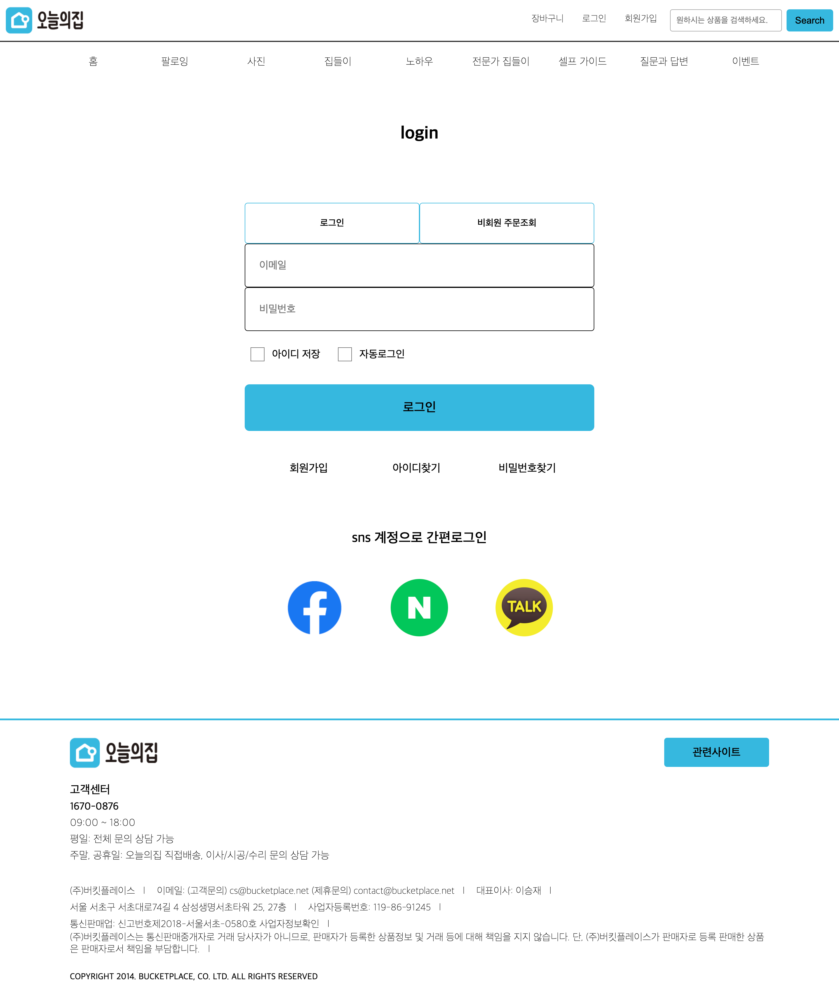

# ohou_project
### project 소개
- 기존 웹  사이트보다 접근성을 높이고자 웹  사이트 재구축하기 위함이 목적
- main, login page 제작
- 320px, 768px, 1280px, 1440px, 1920px로 반응형 제작

---
### 사용기술
- HTML
- CSS
- Javascript

---
### 보안사항
- 다른 페이지 추가 구성
- Javascript 기능 추가 구현

---
### 🏠 OHOU 오늘의집 <a href="https://hyunao.github.io/ohou_project/html/01_prototype_1280_main.html">자세히 보기</a>

ohou 오늘의집 page 구경하기🖱

💙 main page

  

💙 login page

